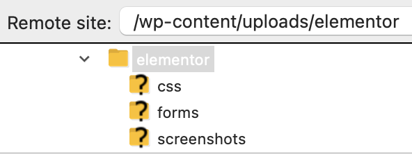

# wp-mac
A media access control script for WordPress sites. Not like [this](https://en.wikipedia.org/wiki/Medium_access_control). I mean WordPress media assets stored in the /wp-content/uploads/ directory.
## Quickstart
### Install
Install these two files alongside your WordPress install on the application server. For example:
```
./wp-includes/
./wp-content/
./wp-admin/
./mac.php
./mac-requires.php
```
Then add a rewrite rule to your web server's configuration that sends requests for any files in `./wp-content/uploads/_auth/` to `mac.php?file=$1`. For example:
* Apache: `RewriteRule ^/wp-content/uploads/(_auth/.+)$ /mac.php?file=$1 [QSD,L]`
* Nginx: `rewrite ^/wp-content/uploads/(_auth/.+)$ /mac.php?file=$1 last;`
### Use
**NB: See [Caveats](#caveats) below!**

The installation directions will get it working when caching is disabled. Disabling your web server cache universally is obviously a terrible idea, so you'll have to work with your web host and DNS provider to disable caching in a more targeted way. For example, on WP Engine, you can add a Cache Bypass Rule for the `_auth` directory (by opening a tech support ticket). On Cloudflare, you can add a page rule for the `_auth` directory, or you can turn the site to "gray" mode by clicking the cloud icon in the DNS tab.

When requests for assets in the /_auth/ subdirectory hit the app server, it'll use mac.php to decide whether or not to serve an asset. Since caching is disabled, each time the asset is needed by a browser, the (responsible) browser will have to ask for it again.
## The long story
### What? Why?
WP is a great ecosystem for designing all kinds of CMS-driven websites. Sometimes it's used to build sites that need to be accessible over the web, but only to authenticated visitors. The built-in password protection feature doesn't cover all kinds of commonly used corner cases, like:
* Custom post types
* Media file templates
* Media files themselves

This means anybody who either guesses a media file's static URL or once accessed it using valid authentication can just copy-paste the URL to all their unauthenticated friends. This is a problem for sites that want to keep their media files private.

### Problem: Websites are meant to be public
A website is not a web app: it's meant to be found and viewed by anonymous users on the public web. But I was asked to make a public site's assets inaccessible to anonymouse users.

There are layers of service trying to make public sites fast and accessible everywhere: caching, CDNs, and edge networks. All these like to store copies of files from your site.

App servers (like WP) are slow. This means handling every HTTP request on the app server results in much higher CPU workload.

Certain hosts don't like caching sidesteps, i.e. WP Engine required a conversation with tech support for each cache bypass rule. Convincing them to let me do something weird took a little bit of effort.

### Solution: A bricolage of configurations and code at every layer
WP is arcane, to say the least. Its documentation doesn't provide a comprehensive view into its inner workings. Its plugin and theme ecosystem is a wild west of hooks and filters. The best two tools I found for understanding what happens when a page is loaded are the [Query Monitor](https://wordpress.org/plugins/query-monitor/) plugin and the [Debug Bar](https://wordpress.org/plugins/debug-bar/) plugin. Both are great, but they're not enough.

So I took cues from those who came before (see [Kudos](#kudos)) and simply bypassed the whole thing. mac.php runs as a top-level script, rather than as a plugin or child theme or WP hook. This gives me full visibility (and thus total control) over what happens in response to the HTTP requests I care about.

Because of a lack of guidance or enforcement by WordPress on how the /wp-content/uploads/ folder is used, many plugins and even theme providers add their content to subdirectorys of that folder. This means some requests from the browser are asking for public assets that aren't part of WP's media library, but they live in the media library's folder. For example, the venerable Elementor:


To work around this, I had to put *controlled* assets in my own subdirectory of /uploads/. You'll see this in the script as `_auth`.

Of course, the WP admin media manager doesn't like that, so I had to add a plugin to the site that lets you put media files wherever you want on disk: [Media Library Folders](https://wordpress.org/plugins/media-library-plus/) by Max Foundry. Although it's not a perfect solution, it's the best I could find.

As for configuring various servers that stand between the app and the browser, that was a matter of trudging through documentation and tech support conversations for each provider in the hosting chain. In one implementation those were WP Engine and Cloudflare, so you'll find references to handling them up in the [Use](#use) section.

Finally, there's the issue of naughty users trying to save a file from the page they see it on. Any of the WP plugins that disable right-click downloading solves this.

## Caveats
1. This is only part of the full solution for controlling access to WP media files! You'll need to do more work to make sure your site is secure.
1. I think an optimal solution would integrate fully with WordPress itself through action and filter hooks, or as a proper plugin. This would probably address the following things my script doesn't do:
### Things it still doesn't do
* It sidesteps WordPress rather than plugging into the engine using hooks and filters (or as a plugin)
* It ignores query strings from the original request, so it can't be used to serve different versions or resolutions of a file
* Stop WordPress from automatically generating an [attachment template](https://developer.wordpress.org/themes/template-files-section/attachment-template-files/) that display the file happily to anyone
* Stop any theme from including attachment templates
### Things I can't control
* Plugins' and themes' (mis?)use of the /wp-content/uploads/ directory in ways that would interfere with this script
* Sneaky or malicious users who know how to make their browser do nonstandard things
* There’s pretty much nothing I can do for non-image assets. PDFs, XLSs, DOCXs, etc are delivered to the browser directly so a native app can display the file. At that point, the file is in the user’s local browser cache.
* If a visitor’s browser cached an asset sometime before setting up access control, I can’t do anything about that.
* If there’s another intermediate server caching assets, I might not know about it.
* mac.php gets called when *any browser process* requests a file from the /_auth/ folder. That includes the wp-admin UI, plugins, etc. So it could cause some weirdness when browsing the media library or writing posts or using Elementor. For example, I’ve seen situations where thumbnails won't load in the admin UI.
## Kudos
When researching this problem, I ran across two resources that helped tremendously:
* [Restrict Access to wp-content/uploads when User is not Logged In](https://carlofontanos.com/restrict-access-to-wp-contentuploads-when-user-is-not-logged-in/) by Carlo Fontanos
* [dl-file.php](https://gist.github.com/hakre/1552239) by hakre, along with many of the comments on that gist

I also used the [MDN documentation on HTTP caching](https://developer.mozilla.org/en-US/docs/Web/HTTP/Caching) as a reference.
## License
[GPL3](LICENSE)

## Tests
Because of the complexity of the full solution, no automated tests were written. Instead, I made a testing grid and worked through its examples manually. You can find the Excel file [here](assets/MAC_script_testing_grid.xlsx).
